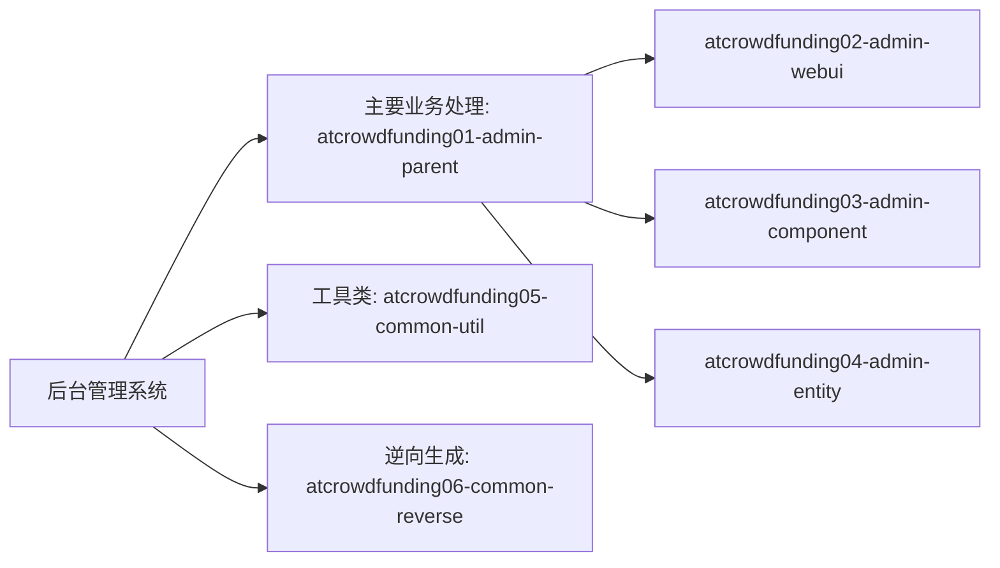
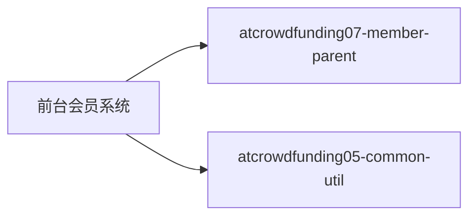

# 众筹网站

## 一、简介

### ①后台管理系统

### ②前台会员系统

eureka注册中心

feign创建抽象方法调用远程provider接口给consumer

spring-session共享（基于redis）

redis短信存储服务

腾讯云的短信发送服务

腾讯云的cos存储服务

蚂蚁金服的支付沙箱

### ③第三方应用

腾讯云的短信发送服务

腾讯云的cos存储服务

蚂蚁金服的支付沙箱

